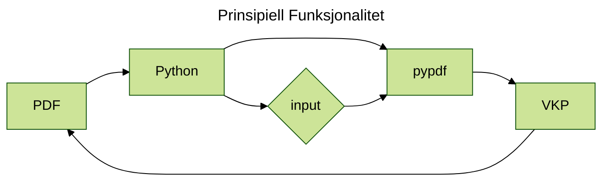

### Hele Programmet:

```mermaid
--- 
title: Prinsipiell Funksjonalitet
--- 
%%{init: { "theme": "forest" } }%%
flowchart LR 
	id1[PDF] --> id2[Python] --> id3[pypdf]
	id2 --> id4{input} --> id3
	id3 --> id5[VKP] -->id1
```

